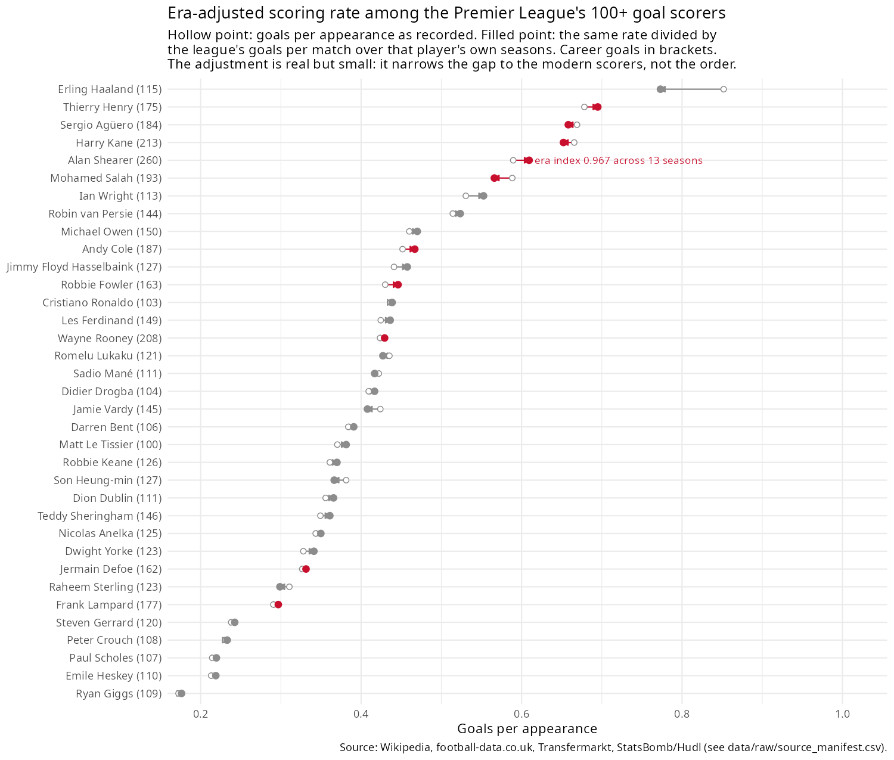
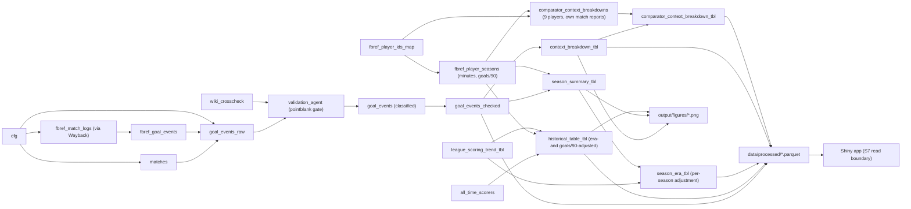

# Alan Shearer's 260 ⚽

An era-adjusted, fully-sourced analysis of Alan Shearer's Premier League scoring
record (1992–93 to 2005–06, Blackburn Rovers and Newcastle United). Every number
traces to a named source and every non-trivial transformation is a tested
function; gaps in coverage are declared, never filled.

## Why it's built this way 🧭

Two properties of this project drive most of the design:

1. **A ranking is only as honest as its era-adjustment.** Raw goals-per-appearance
   ranks Shearer 5th among the Premier League's 100-goal club, behind four players
   from a higher-scoring era. `R/10_analyse_comparators.R` computes each player's
   own scoring environment — the league's goals-per-match over the seasons they
   actually played, from `football-data.co.uk` — and adjusts their rate against it.
   Shearer's adjusted rate rises from 0.590 to 0.609 (era index 0.967, 13 seasons
   matched — 1992-93 has no football-data.co.uk scoring-environment source, see
   below). The order barely moves: the adjustment narrows the gap to the modern
   scorers, it doesn't invert the ranking, and `fig_comparators()` draws both
   points so a reader can see the size of the effect rather than take it on faith.
   The adjustment is also declared as coarse — Wikipedia's career span is recorded
   in years, not a verified season list — in `docs/limitations.md`, rather than
   presented as more precise than it is.
2. **One source is a claim; two independent sources agreeing is evidence.** The
   FBref-derived goal log and Wikipedia's per-match season tables share no fetch,
   no parser, and no intermediate table. `R/03_ingest_wikipedia.R` parses every
   Blackburn/Newcastle season article match-by-match (handling both the wikitable
   and `{{football box collapsible}}` formats Wikipedia uses across different
   seasons) and `R/07_validate.R` cross-checks the two logs independently, on top
   of a [pointblank](https://rstudio.github.io/pointblank/) gate that halts the
   pipeline on any reconciliation failure. Result: **468/468 matches agree
   (100%)**, covering 236 of 260 goals across 12 of 14 seasons — the 2 uncovered
   seasons have no per-match section on Wikipedia, and that gap is stated in
   `docs/validation.md`, not folded into the "checked" total.

## Headline finding 📈



Hollow point: goals per appearance as recorded. Filled point: the same rate
divided by the league's goals-per-match over that player's own seasons. The
segment between them is the whole adjustment, drawn rather than asserted.

Season by season, the finding is less flattering than the raw total suggests,
and the dashboard says so rather than hiding it: among the ten highest career
scorers in this dataset, Shearer ranks **4th** by era-adjusted goals per
appearance (0.609) — behind Thierry Henry (0.695), Sergio Agüero (0.658) and
Harry Kane (0.652). He holds the all-time goals record on **durability**, not
on rate: 441 appearances across 14 seasons. His own three-season peak
(1994–95 to 1996–97, adjusted 0.844–0.919) sits above every other player's
career band — but a peak isn't a like-for-like comparison against a full
career, and the app's Comparators tab states that caveat next to the chart
rather than leaving a reader to infer it.

## Live demo 🌐

[shearer-260.shinyapps.io](https://datakrdo.shinyapps.io/shearer-260/) — no
install required. Free tier: sleeps when idle, first load can take a few
seconds to wake up.

## Quick start 🚀

Environment is managed with [`renv`](https://rstudio.github.io/renv/):

```r
renv::restore()
targets::tar_make()
shiny::runApp("app")
```

`tar_make()` rebuilds `data/processed/*.parquet`, `output/figures/*.png` and
`docs/*.md` from a [`{targets}`](https://books.ropensci.org/targets/) DAG — a
no-op rerun skips all 57 targets, and a change to one analysis or figure
function reruns only that target and its downstream outputs, not the ingest
and Wikipedia-parsing stages (the slow part, and the part that never changes).
The Shiny app reads only the parquet files (through a validated S7 read
boundary, `R/13_dataset.R` — see below), so it runs the same way whether the
pipeline was just rebuilt or last run weeks ago.

```r
devtools::test()   # 257 tests, no network calls
```

Reference documentation (roxygen2): `man/`, or `devtools::document()` +
`?function_name` after `devtools::load_all()`.

### Deploying the dashboard

`Rscript deploy.R` bundles `app/`, `data/processed/`, `config/` and
`docs/*.md` into a temp directory and pushes it to
[shinyapps.io](https://www.shinyapps.io/) via `rsconnect::deployApp()`.
One-time setup: an account token (`rsconnect::setAccountInfo()`) and
`remotes::install_github("datakrdo/portfolio", subdir = "shearer")`, so
`rsconnect` can resolve the `shearer` package from the public repo instead
of a local install.

## Dashboard 📊

`shiny::runApp("app")` opens a six-panel bslib dashboard (dark-mode toggle in
the navbar, top right), with a shaded-card look and a football-angle insight
called out under every chart (`R/14_insights.R` — tested, derived-only functions,
never a hardcoded number in `app/app.R`):

- **Overview** — six value boxes (goals, seasons, goals/90, times as league
  top scorer, clutch-goal share, minutes per goal or assist) and the
  goals-by-season trajectory, with the two injury-driven low seasons
  (1997–98, 2000–01) footnoted individually.
- **Comparators** — three charts, not tables: Shearer's season total against
  that season's actual top scorer, a dumbbell of raw vs. era-adjusted goals
  per 90 across the ten highest career scorers, and Shearer's own
  era-adjusted rate season by season. Each carries a written reading of the
  numbers underneath, computed live from the same tables the chart draws from.
- **Goal types & context** — a donut for goal type (open play / penalty /
  free kick / unknown), a radar chart for the context in which each goal was
  scored (equaliser, go-ahead, extend lead, reduce deficit), a stacked bar
  comparing that context share across all ten comparators, each fetched and
  classified independently from their own match reports.
- **Rival explorer** — pick an opponent and a season range; a per-meeting
  timeline (scored vs. blanked, whole-number axis) plus the Wilson and
  Beta-Binomial intervals on the scored-in rate, side by side.
- **Tables** — the top 10 all-time scorers (of the full 100+ list) and the
  full 260-goal event log, reactable-powered (sortable, filterable,
  dark-mode aware, Shearer's row always highlighted).
- **Data & limitations** — the generated `docs/limitations.md` and
  `docs/methodology.md` reports, read live rather than duplicated in the app.

## Pipeline 🏗️



(Simplified — the full 57-target DAG is viewable with
`targets::tar_visnetwork()`.)

- `R/03_ingest_wikipedia.R` — season infoboxes, per-match results (two wikitext
  formats), the all-time scorers list with career span, all cached once fetched.
- `R/04*_ingest_*.R` — Transfermarkt goal log (goal_type only), football-data.co.uk
  results, StatsBomb/Hudl open shot data, and `R/04c_ingest_fbref.R` — the
  primary goal-event source, fetched through Internet Archive Wayback Machine
  snapshots (`R/01_sources.R`'s `cache_fetch_wayback()`) since fbref.com itself
  returns a Cloudflare challenge on the first request.
- `R/05_build_matches.R` / `R/06_build_goal_events.R` — reconciles sources into
  one match table and one goal-event table, club names normalised via a
  config-driven alias lookup.
- `R/07_validate.R` — the pointblank gate and the independent per-match
  cross-check.
- `R/08_classify_context.R` / `R/09_analyse.R` / `R/10_analyse_comparators.R` —
  goal context (equaliser/go-ahead/etc.), season/opponent/context summaries,
  and the era-adjustment. `comparator_context_breakdown_for()`
  (`R/09_analyse.R`) reruns the same match-log-to-context pipeline
  independently for each of the 9 non-Shearer comparators, from their own
  FBref match reports — never touching Shearer's own 260-goal branch.
- `R/11_figures.R` / `R/12_reports.R` — the 5 figures and the markdown reports
  under `docs/`.
- `R/00_shared.R` — small helpers shared by the pipeline and `app/app.R`:
  `wilson_ci()` and `beta_binomial_ci()` (frequentist/Bayesian intervals),
  `plot_series()` (rlang tidy-eval ggplot helper), colour constants.
- `R/13_dataset.R` — the S7 `shearer_data` class the app reads through: it
  validates every processed table at launch (non-empty, expected columns, the
  goal count matching `config.yaml`) so a stale `data/processed/` fails loudly
  at startup instead of rendering a half-built dashboard.
- `_targets.R` — the pipeline DAG; `app/app.R` — the Shiny dashboard.

## Skills 🧠

- Multi-source data reconciliation and provenance tracking
- Wikitext/HTML parsing across inconsistent source formats
- Statistical validation gating (pointblank) and independent cross-checking
- Era/context-adjusted rate normalisation
- Declared-coverage-gap handling (no imputation)
- `{targets}` DAG pipeline design for cached, incremental reproducibility
- Interactive exploration (Shiny)
- Config-driven, testable R package structure

## Tools 🛠️

- R, `{targets}`, `renv`, structured as an installable package (roxygen2)
- dplyr, tidyr, purrr, stringr, rlang (tidy-eval plot helpers)
- ggplot2, gt, ggsoccer
- S7 (validated dataset class), pointblank
- Shiny, bslib, reactable, plotly
- testthat

## Data provenance and limitations 📎

Five sources, never merged into a single number without cross-checking:
FBref (goal events, real per-match minutes — fetched via the Internet
Archive, since fbref.com itself blocks direct requests behind a Cloudflare
challenge; see `THIRD_PARTY_NOTICES.md`), the Transfermarkt goal-by-goal log
(goal `type` only, left-joined by season/opponent/minute), Wikipedia
(infoboxes, per-match tables, all-time list), football-data.co.uk (results,
league scoring environment, 1993-94 onward), and StatsBomb/Hudl open data (2
Shearer shots, both from Arsenal's 2003/04 matches — shown as evidence of
the limit, not a shot map). 1992-93 has no league-wide scoring-environment
source and is declared absent, not backfilled. Goal `type` carries an honest
"unknown" bucket for anything that doesn't match a Transfermarkt row, not
imputed. Real minutes (and so goals/90 and minutes per goal or assist) are
only available for the comparators pinned in `config.yaml`'s
`sources.fbref.comparator_player_ids` — every other player on the all-time
list keeps `goals_per_90` and `minutes_per_goal_or_assist` as `NA`, a
declared gap. The era adjustment uses career-span years from Wikipedia's
all-time table, which can be off by a season at either edge for a player who
didn't play every season in that span. Full detail: `docs/validation.md`,
`docs/methodology.md`, `docs/data_dictionary.md`, `docs/coverage.md`,
`docs/limitations.md`.
