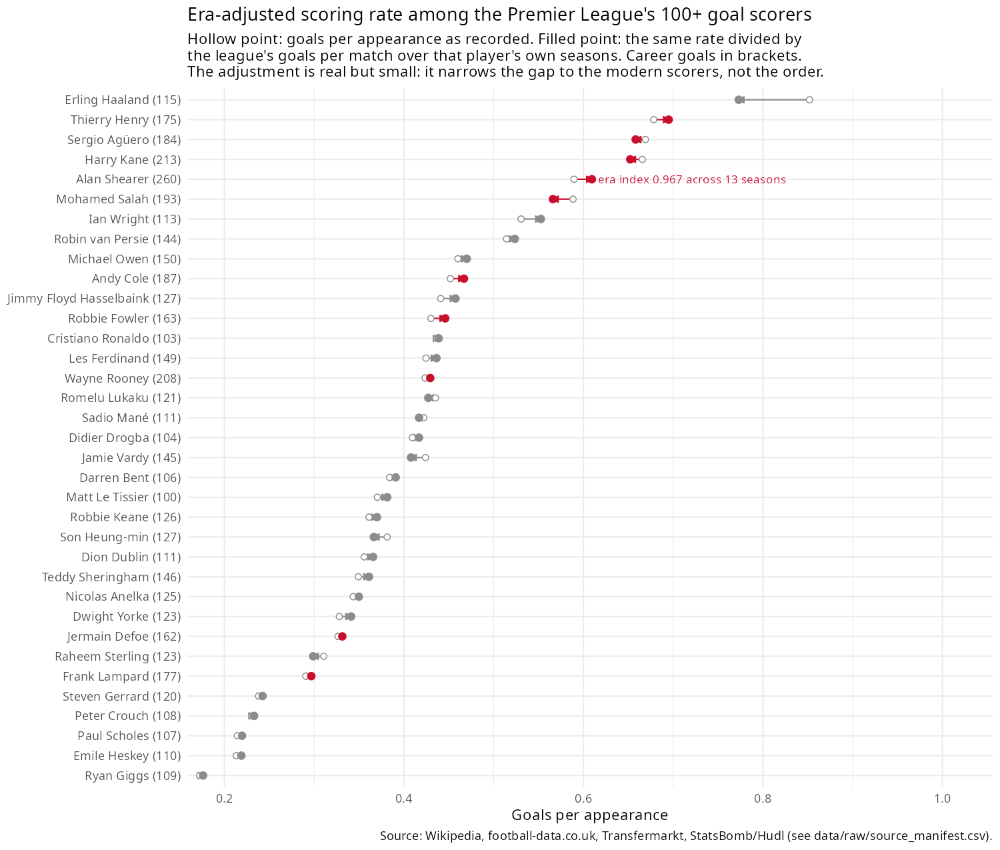
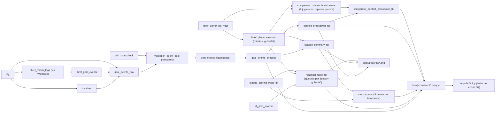

🇬🇧 [English](README.md) · 🇪🇸 [Español](README_es.md)

# Los 260 de Alan Shearer ⚽

Un análisis con ajuste por época y totalmente trazable a sus fuentes de la carrera
goleadora de Alan Shearer en la Premier League (1992–93 a 2005–06, Blackburn Rovers y
Newcastle United). Cada número se rastrea hasta una fuente nombrada y cada
transformación no trivial es una función testeada; los huecos de cobertura se declaran,
nunca se rellenan.

## Por qué está construido así 🧭

Dos propiedades del proyecto guían la mayoría de las decisiones de diseño:

1. **Un ranking es tan honesto como su ajuste por época.** Los goles por partido crudos
   ubican a Shearer 5to entre el club de los 100 goles de la Premier League, detrás de
   cuatro jugadores de una época más goleadora. `R/10_analyse_comparators.R` calcula el
   entorno goleador propio de cada jugador — los goles por partido de la liga durante las
   temporadas en las que jugó, tomado de `football-data.co.uk` — y ajusta su tasa contra
   ese entorno. La tasa ajustada de Shearer sube de 0,590 a 0,609 (índice de época 0,967,
   13 temporadas emparejadas — 1992-93 no tiene fuente de entorno goleador en
   football-data.co.uk, ver abajo). El orden casi no cambia: el ajuste acorta la brecha
   con los goleadores modernos, no invierte el ranking, y `fig_comparators()` dibuja
   ambos puntos para que quien lo lea vea el tamaño del efecto en vez de tener que
   creerlo. El ajuste también se declara como aproximado — el rango de carrera de
   Wikipedia está registrado en años, no como una lista de temporadas verificada — en
   `docs/limitations.md`, en vez de presentarse como más preciso de lo que es.
2. **Una fuente es una afirmación; dos fuentes independientes que coinciden es
   evidencia.** El registro de goles derivado de FBref y las tablas de partido a partido
   de Wikipedia no comparten fetch, ni parser, ni tabla intermedia. `R/03_ingest_wikipedia.R`
   parsea cada artículo de temporada de Blackburn/Newcastle partido por partido (maneja
   tanto el formato wikitable como el `{{football box collapsible}}` que usa Wikipedia
   según la temporada) y `R/07_validate.R` cruza los dos registros de forma
   independiente, además de un gate de [pointblank](https://rstudio.github.io/pointblank/)
   que frena el pipeline ante cualquier falla de reconciliación. Resultado: **468/468
   partidos coinciden (100%)**, cubriendo 236 de los 260 goles en 12 de 14 temporadas —
   las 2 temporadas sin cobertura no tienen sección partido a partido en Wikipedia, y ese
   hueco se declara en `docs/validation.md`, sin sumarse al total "verificado".

## Hallazgo principal 📈



Punto hueco: goles por partido tal como se registraron. Punto lleno: la misma tasa
dividida por los goles por partido de la liga durante las temporadas propias de ese
jugador. El segmento entre ambos es el ajuste completo, dibujado en vez de afirmado.

Temporada a temporada, el hallazgo es menos favorecedor que el total de carrera, y el
dashboard lo dice en vez de esconderlo: entre los diez máximos goleadores de carrera de
este dataset, Shearer queda **4to** en goles por partido ajustados por época (0,609) —
detrás de Thierry Henry (0,695), Sergio Agüero (0,658) y Harry Kane (0,652). Sostiene el
récord histórico de goles por **durabilidad**, no por tasa: 441 partidos en 14
temporadas. Su propio pico de tres temporadas (1994–95 a 1996–97, ajustado 0,844–0,919)
queda por encima de la banda de carrera de cualquier otro jugador — pero un pico no es
una comparación equivalente contra una carrera completa, y la pestaña Comparadores de la
app aclara eso junto al gráfico en vez de dejarlo para que se infiera.

## Demo en vivo 🌐

[shearer-260 en shinyapps.io](https://8o0sz0-federico-dignani.shinyapps.io/shearer-260/) —
sin instalación. Plan gratuito: se duerme si está inactiva, la primera carga puede tardar
unos segundos en despertarla.

## Inicio rápido 🚀

El entorno se maneja con [`renv`](https://rstudio.github.io/renv/):

```r
renv::restore()
targets::tar_make()
shiny::runApp("app")
```

`tar_make()` reconstruye `data/processed/*.parquet`, `output/figures/*.png` y
`docs/*.md` a partir de un DAG de [`{targets}`](https://books.ropensci.org/targets/) —
una re-corrida sin cambios se salta los 57 targets, y un cambio en una función de
análisis o de figura solo recorre ese target y lo que depende de él, no las etapas de
ingesta y parseo de Wikipedia (la parte lenta, y la que nunca cambia). La app de Shiny
solo lee los archivos parquet (a través de un límite de lectura validado con S7,
`R/13_dataset.R` — ver abajo), así que corre igual sin importar si el pipeline se acaba
de reconstruir o corrió hace semanas.

```r
devtools::test()   # 259 tests, sin llamadas de red
```

Documentación de referencia (roxygen2): `man/`, o `devtools::document()` +
`?nombre_funcion` después de `devtools::load_all()`.

### Desplegando el dashboard

`Rscript deploy.R` empaqueta `app/`, `data/processed/`, `config/` y `docs/*.md` en un
directorio temporal y lo sube a [shinyapps.io](https://www.shinyapps.io/) vía
`rsconnect::deployApp()`. Configuración inicial: un token de cuenta
(`rsconnect::setAccountInfo()`) y `remotes::install_github("datakrdo/portfolio", subdir
= "shearer")`, para que `rsconnect` pueda resolver el paquete `shearer` desde el repo
público en vez de una instalación local.

## Dashboard 📊

`shiny::runApp("app")` abre un dashboard bslib de seis pestañas (toggle de modo oscuro
en la navbar, arriba a la derecha), con un look de tarjetas sombreadas y un insight
futbolístico debajo de cada gráfico (`R/14_insights.R` — funciones testeadas y
derivadas, nunca un número hardcodeado en `app/app.R`):

- **Overview** — seis value boxes (goles, temporadas, goles/90, veces como goleador de
  la liga, porcentaje de goles clutch, minutos por gol o asistencia) y la trayectoria de
  goles por temporada, con las dos temporadas bajas por lesión (1997–98, 2000–01)
  anotadas individualmente.
- **Comparadores** — tres gráficos, no tablas: el total de temporada de Shearer contra
  el goleador real de esa temporada, un gráfico dumbbell de goles por 90 crudos vs.
  ajustados por época entre los diez máximos goleadores de carrera, y la tasa ajustada
  por época propia de Shearer temporada a temporada. Cada uno lleva una lectura escrita
  de los números debajo, calculada en vivo desde las mismas tablas que dibuja el
  gráfico.
- **Tipos y contexto de gol** — una dona por tipo de gol (juego abierto / penal / tiro
  libre / desconocido), un radar por el contexto en que se marcó cada gol (empate,
  ponerse en ventaja, ampliar ventaja, descontar), una barra apilada comparando esa
  distribución de contexto entre los diez comparadores, cada uno buscado y clasificado
  de forma independiente desde sus propios reportes de partido.
- **Explorador de rivales** — elegí un rival y un rango de temporadas; una línea de
  tiempo por encuentro (marcó vs. no marcó, eje de números enteros) más los intervalos
  de Wilson y Beta-Binomial sobre la tasa de "marcó", lado a lado.
- **Tablas** — los 10 máximos goleadores históricos (de la lista completa de más de
  100) y el registro completo de los 260 goles, con reactable (ordenable, filtrable,
  compatible con modo oscuro, la fila de Shearer siempre resaltada).
- **Datos y limitaciones** — los reportes generados `docs/limitations.md` y
  `docs/methodology.md`, leídos en vivo en vez de duplicados en la app.

## Pipeline 🏗️



(Simplificado — el DAG completo de 57 targets se puede ver con
`targets::tar_visnetwork()`.)

- `R/03_ingest_wikipedia.R` — infoboxes de temporada, resultados partido a partido (dos
  formatos de wikitexto), la lista histórica de goleadores con rango de carrera, todo
  cacheado una vez obtenido.
- `R/04*_ingest_*.R` — registro de goles de Transfermarkt (solo `goal_type`), resultados
  de football-data.co.uk, datos abiertos de tiros de StatsBomb/Hudl, y
  `R/04c_ingest_fbref.R` — la fuente principal de eventos de gol, obtenida a través de
  capturas de Internet Archive Wayback Machine (`cache_fetch_wayback()` de
  `R/01_sources.R`) ya que fbref.com devuelve un challenge de Cloudflare en la primera
  petición.
- `R/05_build_matches.R` / `R/06_build_goal_events.R` — reconcilia las fuentes en una
  única tabla de partidos y una de eventos de gol, con nombres de club normalizados vía
  un lookup de alias configurable.
- `R/07_validate.R` — el gate de pointblank y el cruce independiente partido a partido.
- `R/08_classify_context.R` / `R/09_analyse.R` / `R/10_analyse_comparators.R` —
  contexto de gol (empate/ponerse en ventaja/etc.), resúmenes por temporada/rival/
  contexto, y el ajuste por época. `comparator_context_breakdown_for()`
  (`R/09_analyse.R`) vuelve a correr el mismo pipeline de partido-a-contexto de forma
  independiente para cada uno de los 9 comparadores que no son Shearer, desde sus
  propios reportes de FBref — sin tocar nunca la rama de los 260 goles de Shearer.
- `R/11_figures.R` / `R/12_reports.R` — las 5 figuras y los reportes en markdown bajo
  `docs/`.
- `R/00_shared.R` — helpers chicos compartidos entre el pipeline y `app/app.R`:
  `wilson_ci()` y `beta_binomial_ci()` (intervalos frecuentista/bayesiano),
  `plot_series()` (helper de ggplot con tidy-eval de rlang), constantes de color.
- `R/13_dataset.R` — la clase S7 `shearer_data` que lee la app: valida cada tabla
  procesada al arrancar (no vacía, columnas esperadas, cantidad de goles coincidiendo
  con `config.yaml`) para que un `data/processed/` desactualizado falle ruidosamente al
  inicio en vez de renderizar un dashboard a medio construir.
- `_targets.R` — el DAG del pipeline; `app/app.R` — el dashboard de Shiny.

## Habilidades 🧠

- Reconciliación de datos multi-fuente y trazabilidad de procedencia
- Parseo de wikitexto/HTML entre formatos de fuente inconsistentes
- Validación estadística con gates (pointblank) y cruce independiente
- Normalización de tasas ajustada por época/contexto
- Manejo de huecos de cobertura declarados (sin imputación)
- Diseño de pipeline DAG con `{targets}` para reproducibilidad incremental cacheada
- Exploración interactiva (Shiny)
- Estructura de paquete R testeable y config-driven

## Herramientas 🛠️

- R, `{targets}`, `renv`, estructurado como paquete instalable (roxygen2)
- dplyr, tidyr, purrr, stringr, rlang (helpers de gráficos con tidy-eval)
- ggplot2, gt, ggsoccer
- S7 (clase de dataset validada), pointblank
- Shiny, bslib, reactable, plotly
- testthat

## Procedencia de datos y limitaciones 📎

Cinco fuentes, nunca fusionadas en un solo número sin cruzarlas:

- **FBref** — eventos de gol, minutos reales por partido. Obtenido vía Internet
  Archive, ya que fbref.com bloquea las peticiones directas detrás de un challenge de
  Cloudflare (ver `THIRD_PARTY_NOTICES.md`).
- **Transfermarkt** — el registro gol por gol, solo el `type` de gol, unido por
  temporada/rival/minuto.
- **Wikipedia** — infoboxes de temporada, tablas partido a partido, la lista histórica
  de goleadores.
- **football-data.co.uk** — resultados de partidos y el entorno goleador de la liga,
  desde 1993-94.
- **StatsBomb/Hudl** — datos abiertos de tiros: 2 tiros de Shearer, ambos de partidos
  contra el Arsenal en 2003/04, mostrados como evidencia del límite, no como mapa de
  tiros.

Huecos declarados, ninguno rellenado en silencio:

- **1992-93** no tiene fuente de entorno goleador a nivel liga y queda fuera del ajuste
  por época, no se rellena.
- **El `type` de gol** tiene un bucket honesto de "desconocido" para lo que no matchea
  con una fila de Transfermarkt, no se imputa.
- **Los minutos reales** (y por lo tanto `goals_per_90` y minutos por gol o asistencia)
  solo están disponibles para los comparadores fijados en
  `sources.fbref.comparator_player_ids` de `config.yaml` — el resto de la lista
  histórica mantiene esas columnas como `NA`.
- **El ajuste por época** usa los años de rango de carrera de la tabla histórica de
  Wikipedia, que puede desfasarse una temporada en cualquiera de los dos extremos para
  un jugador que no jugó todas las temporadas de ese rango.

Detalle completo: `docs/validation.md`, `docs/methodology.md`,
`docs/data_dictionary.md`, `docs/coverage.md`, `docs/limitations.md`.
